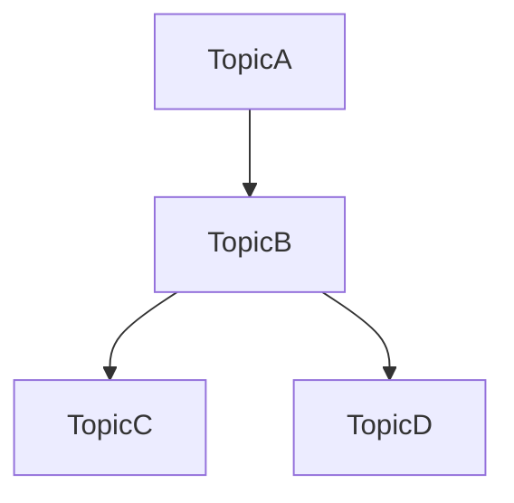
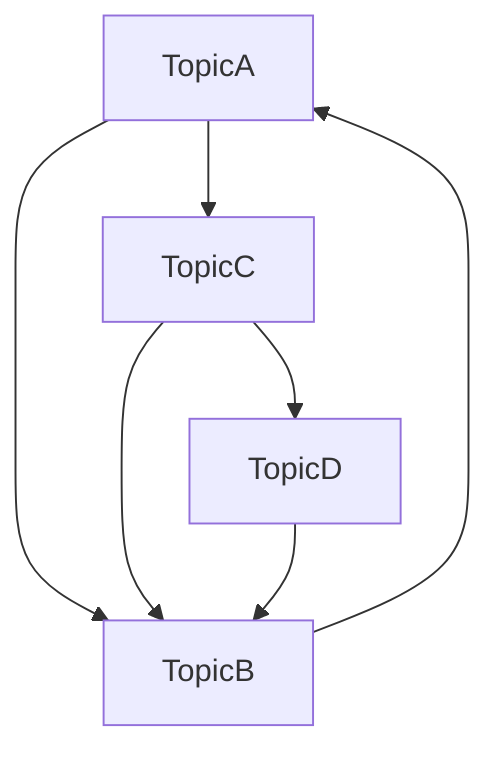

If *TopicA* links to *TopicB*, it may not be obvious that there is a connection when looking at *TopicB* particularly as content in a [[Digital garden]] is almost always non-hierarchical. Instead of:

we have:

It's a lot of work to create and maintain all these [[Backlink|backlinks]] and secondly, by simply writing and linking pages, the list of automatically generated backlinks can highlight connections between pages in unexpected ways which generate new ideas and relationships.