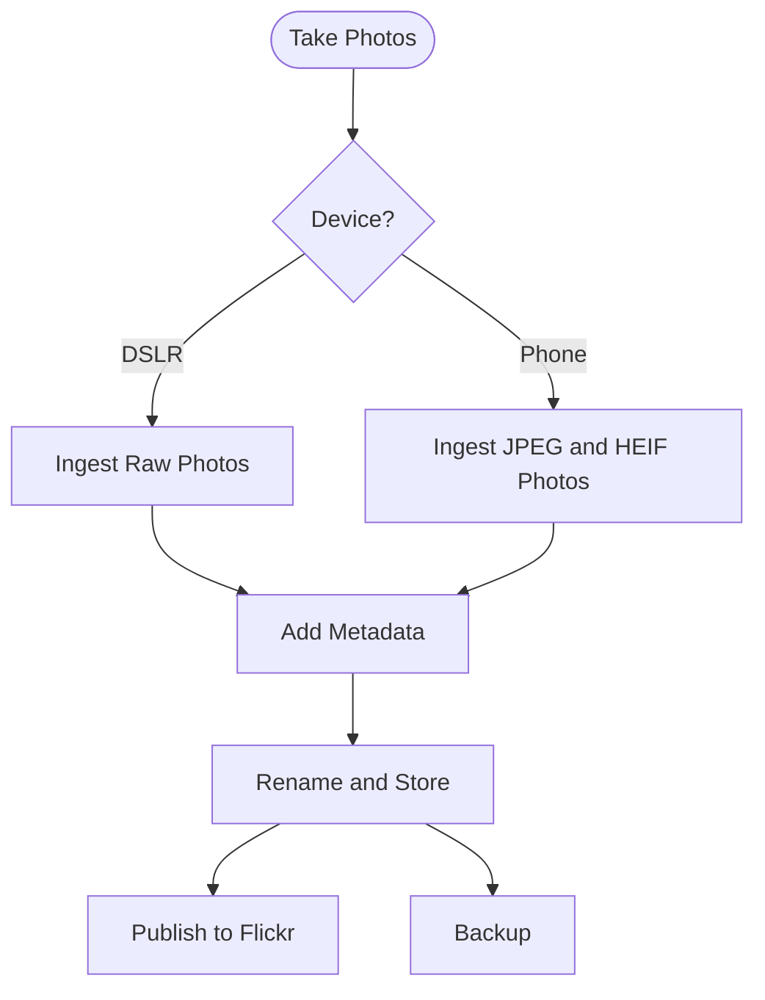

---
tags:
  - photography
  - digital-asset-management
date: 2023-10-25
landscapes:
  - "[[hobby-together]]"
  - "[[quantum-os]]"
growth: "[[Budding]]"
---
This is the first of a series of articles I plan to write on how I take a photo or movie shot on a camera right through to archive with full metadata for future family historical purposes.

My role in all this, apart from enjoying photograph myself, is to be the curator of photos for my family.

Throughout the process my goal is to keep the original image in as pristine condition as possible and to only rename it or add metadata in a non-destructive manner. My main tools are [[IMatch]] [IMatch](https://www.photools.com/imatch/) as my [Digital Asset Management system](https://en.wikipedia.org/wiki/Digital_asset_management), and [Adobe Lightroom](https://www.adobe.com/au/products/photoshop-lightroom-classic.html) for photo manipulation.

Here is the high-level process that I'll explain in more detail within this article and a follow-up titled [[The Meta of My Metadata]].

1. Ingest photos from a camera card or shared OneDrive file using Lightroom. I have presets that file the photos where I want them and converts any RAW format files to DNG as it does so. Copyright data is added at this point.
2. Cull the bad photos in Lightroom. 
3. Merge exposure bracketed photos into a HDR master and stitch together any panorama shots.
4. Photos I know I want to develop further in Lightroom are marked 5 stars.
5. Rename photos into my standard naming format.

|  Step                                                                                                                                         |  Why                                                                                                   |
|:----------------------------------------------------------------------------------------------------------------------------------------------|:-------------------------------------------------------------------------------------------------------|
|  Copy photos to computer using Lightroom.                                                                                                     |  Lightroom has a good ingestion process and can convert RAW to DNG as it goes. Add copyright metadata. |
| Cull the bad ones, merge exposure bracketed shots into HDR, stitch any panoramas, and rate 5-star those I will want to Develop later on. | This is what Lightroom does.                                                                           |
| Import photos into IMatch                                                                                                                     | Let IMatch now where all the new photos are.                                                           |
| Add all metadata in IMatch.                                                                                                                   | Add metadata and then move files to their final location.                                              |
| Develop DNG files in Lightroom.                                                                                                               | Again, best tool for the job.                                                                          |  

This first article will cover how I get photos from cameras into IMatch via Lightroom.

## From Camera to Computer
The first step is getting a photo or video off the capture device and onto a computer. How I do this depends on the original device.

### Canon DSLR
My [[My Photography Gear|Canon 400D]] is the easiest to work with. Photos are stored on a 4GB Compact Flash card and I transfer them by removing the card from the camera and inserting it into a [memory card reader](https://www.amazon.com.au/dp/B06XSSHZ63) then using Lightroom to "ingest" photos from the card to the computer's SSD.

I followed the steps in Focus Photo School's video 
[How To Import New Photos Into Adobe Lightroom Classic Using An Import Preset - YouTube](https://youtu.be/oR42gmMhBkw) with some changes.

- I shoot in CR2 RAW format and have my preset convert to DNG format. I do this because you cannot store custom metadata directly in a CR2 file. Instead, metadata is written to a XMP sidecar file. One of my main rules is to keep the metadata about a photo in the photo file itself and with DNG I can do that easily.
- I rename files to `YYYY-MM-DD HH.MM.SS_NNNN.DNG` where NNNN is the sequence number from the camera and the other values represent the date and time.
- The root folder of my digital asset library is Mediabank and files are copied to `Mediabank\import\YYYY\YYYY-MM\YYYY-MM-DD`. This gives me the most flexibility to view files in IMatch by both month and individual day. 
- I format the camera in the card before next use.

### Mobile phones
With 3 iPhones and 1 Samsung in the house, I needed a way to reliably get photos from the phone to the PC. Plugging each into a USB port and copying files is unworkable. Photo files are typically not stored with dates, so although the first copy is easy, the next requires I keep track of the last number phot I copied. 

Initially I used Dropbox to automatically upload photos in the background. That worked until Apple removed the ability for an application to constantly run in the background. And I would sometimes run into issues filling our Dropbox capacity. I've moved to OneDrive now, and that has fixed the space problem but the background download problem remains.

Sometimes, when importing photo from iPhones they end up in the wrong day (more on that later) but usually within the same month so I can easily see the date corrections I need to make.

