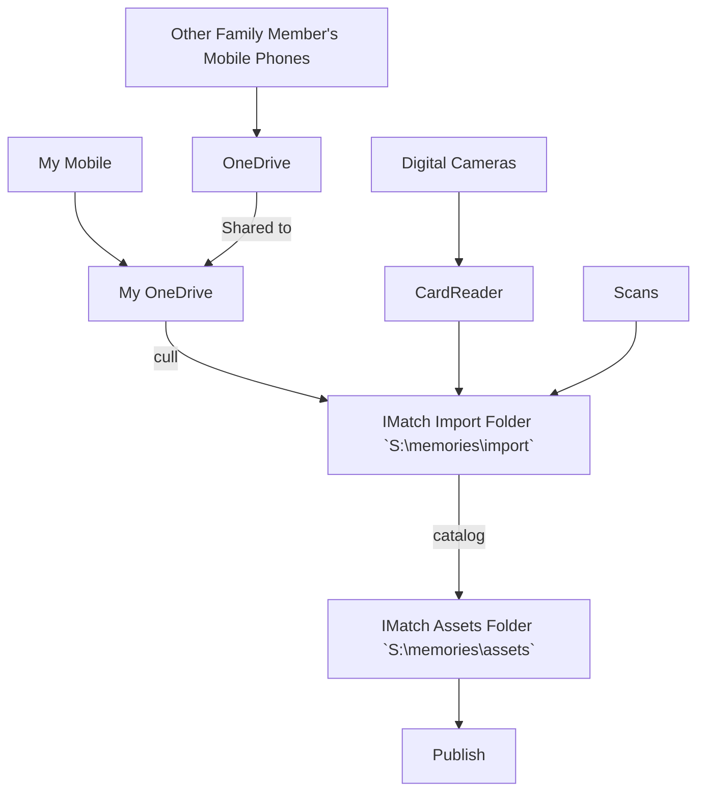

---
tags:
  - metadata-strategy
JD-ID: "[[12.02 Mediabank Photos and Videos]]"
landscapes:
  - "[[hobby-together]]"
growth: "[[Budding]]"
date: 2024-04-08
---
**Mediabank** is the name given to our family [[Photography]] and video archive. It collects all digital media assets (hereafter media) into a single location managed by [[IMatch]]. As of March 2024 there are close to 38,000 items being catalogued and managed consuming 525GB.
## Storage
| Location                         | Purpose                                                                                                     |
| -------------------------------- | ----------------------------------------------------------------------------------------------------------- |
| `S:\memories\assets`             | Final storage location for media in `YYYY\mm -MMMM\` folders.                                               |
| `S:\memories\database`           | Location of the Mediabank.imd5 file.                                                                        |
| `S:\memories\database\Pack & Go` | Periodic backups of the [[Mediabank]] environment using IMatch Pack & Go[^pack].                            |
| `S:\memories\home videos`        | Videos from when we had a video camera. Separated from the other assets to allow easy indexing by [[Plex]]. |
| `S:\memories\import`             | Location of media prior to culling and addition of metadata                                                 |
| `S:\memories\tools`              | Additional reference information e.g., geneaology, scripts                                                  |

`S:\` is a motherboard mounted, high-speed 1TB M.2 SSD drive.
## High Level Process

At a very high level, media are brought into the system, catalogued by having metadata added and filed. From here, some are shared publicly.



## 1. Ingestion to Import Folder

### Digital Cameras

Photos and video from DSLR or Mirrorless cameras are copied to the `import` folder using a card reader (preferred), local wi-fi connection between camera and computer, or USB cable. 
### Mobile Phones
With 3 iPhones[^samsung] in the house, it is difficult to reliably get photos from the phone to the PC in a way that makes managing them once imported easy. Plugging each into a USB port and copying files is unworkable because I need to keep track of the last number photo copied from each phone. The file names do not include the date and time the photo was taken.

OneDrive uploads files and renames them on the way[^dropbox].  However, Apple does disable the app from running the background after a while so periodically I have to remind everyone to go into OneDrive on their phone which reignites the transfer for a few days and catches everything up.

> [!warning] iCloud for Windows is so unreliable in our household I don't go near it. 
> It would frequently fail to sync files, and at other times would chew up 40% of the CPU doing nothing at all. That type of unreliability is unacceptable when dealing with family memories.

Sometimes, when importing photo from iPhones they end up in the wrong day (more on that later) but usually within the same month so I can easily see the date corrections I need to make. The two main culprits are `.mov` files which reference UTC instead of local time, and photos sent from someone else's phone. They have the date received, not the date originally taken.

My daughter and wife's Camera Roll folders are shared into my OneDrive account, and those along with my own are indexed in situ by [[IMatch]]. I perform an initial cull of screenshots of whatever has taken our fancy on social media, or in the shops, before moving the files to the `import` folder. Approximately half- to two-thirds of images disappear here. The iPhone as a camera is used very differently from a dedicated camera such as my [[Canon R50 Mirrorless|Canon R50]].

Rather than move files manually, I use IMatch's [Renamer](https://www.photools.com/help/imatch/index.html#ren_basics.htm) to move and rename files for me. 

> [!example] The "To Import" renamer definition
> ![[imatch-import-renamer.webp]]
> 
> The first three lines create a filename based on the date and time the media was created. At the end between `[` and `]` is a global six-digit unique number. Here the next is 43,411. This ensures if a file has the same date and time, the filename is unique.
> 
> The green line converts the filename extension to lower-case for consistency.
> 
> Finally, the blue Move File line takes the previously renamed file and moves it to the import folder within a `yyyy\mm\yyyy-mm-dd\` structure.
> 
> >> [!NOTE] In this example `20240301_042423338_iOS.jpg` becomes `2024-03-01 15.24.23 [043411],jpg`.
### Scans
600dpi scans from a [[Fujitsu ScanSnap 1300]] are saved directly into the import folder in a sub-folder based on the name of the album they came from. Dates are of no use here. The date is the date of scanning.

# 2. Cataloging

To be fully cataloged, I aim to have every digital asset with:
- Date/Time (When)
- Location (Where)
- GPS coordinates (a bit more where)
- People (Who)
- Event (What)

If a value cannot be determined, the closest is used. In some cases, "Unknown" is a valid choice.
### Date/Time

Every image has the date and time set. 
- Photo date and time from a camera
	- Usually reliable
	- May need adjustment if taken in a different time zone
	- May need setting if photos come from someone else
- Movie files
	- From iPhones need the correct time zone set and a subsequent file rename. This is a weird quirk that iPhone photos have the correct timezone, yet movie files have their time referenced to UTC. IMatch makes it easy to adjust the time and add a timezone. 
- Scanned files
	- Dates and times are entered by hand as a best effort guess.

Ingestion files images by day within a month. This makes it easier to identify and correct date time errors across different media sources. A `.mov` file that has not been corrected will normally be the day before (one advantage of being +10/+11 hours ahead of UTC).

When I have to set a date and I don't know the exact details I follow [[My Photo Dating Strategy for Uncertain Dates]].

> [!TIP] Metadata for Dates
> Dates are stored in the `Date Created` and `DateTimeOriginal` fields.
### Location

Location is a keywords hierarchy. It follows:

- Country
	- State/Province
		- City/Town
			- Location/Suburb
				- Street
					- Building address

A building's address will be `number` - `descriptor` e.g.

- Australia
	- Victoria
		- Bendigo
			- CBD
				- High Street
					- 63 - McDonalds

I don't use the IPTC Country, State/Province, City, Location fields at all. 

If I can't determine a location with specificity, I'll set the lowest category I can. For example, a photo taken in a car whilst travelling in Victoria, without GPS, will be tagged `Australia | Victoria.`

The category is colour-coded blue for a thumbnail's visual indicator of an address being present.

### GPS

If the device doesn't add GPS directly, it is added via the in-built map function. Photos that are all in the same location eg. home, all have the same GPS address and make use of IMatch's various location features.

![[imatch-geocoding example.webp]]
When it's easy to separate pins to where a photo was taken I set separate pins. For searched results, I will use the pin provided.

Not all images will have GPS, just as not all will have a location.
### People
Uses the built in "People" tab. Information is stored and managed by [[IMatch]]. The connection from asset to People is via an annotation. Either through face matching, or direct application (without a matched face). IMatch also stores names in the *XMP:Person in Image* field.
- Each person record made up of
	- Name Surname
	- Sort order (Surname, Name)
	- Date of birth/death
	- Tag gender (male or female)
	- Add categories
		- Gender
		- Nationality
		- Relationships

Pets use the same system.
- Each pet record made up of
	- Name
	- Date of birth/death
	- Gender
	- Group = Pet
	- Add tags
		- Any relevant ie. domestic cat, budgie...
	- Add category - broad class of pet ie. dog, cat, bird, fish

The top-level Who category is dynamically calculated directly off the *XMP:Person in Image* field. 
## Events
I do not use IMatch's built-in Events feature. It's good, but neither fast enough, nor flexible enough for my needs. Event media thumbnails have a pink marker.

![[imatch-top-level-events.webp]]

Events all have their own keyword category. Most are tagged `year - event` e.g.

- Travel & Time Away
	- 1995 - Melbourne Zoo
	- 2000 - Denmark
- Visitors
	- 2007 - Sophie

You'll see Christmas is just the one category. There is one "Decorating the Tree" sub-category. A dynamic category splits the photos out by year.

![[imatch-christmas-category-by-year.webp]]

It's a simple filter by keyword then split by year on the first 4 numbers of the DateCreated field.

![[imatch-christmas-data-driven-category.webp]]

I also split Easter by year, Travel by year, then event, and Who by Year, then name.
## General Keywording

### The Final Flag

Once I'm happy with everything and have added all the metadata I can, I add a label called `Final`.

## Words on the Working Folder

==Some explanation to come on how I QA what metadata is there==
## Media Filename Convention

Media are filed in `S:\memories\assets` following a strict naming convention by date, time and a global unique file number that increases by 1 each use. The use of a global identifier means media with the same date and time remain unique.

```
- yyyy-mm-dd
	- mm MMMM
		- yyyy-mm-dd hh:MM:ss [nnnnn0].ext
		- yyyy-mm-dd hh:MM:ss [nnnnn1].ext
```

![[imatch-media-and-folders.webp]]

As soon as possible after the date and time of a file are confirmed correct during ingestion, the media is renamed.

The process for handling uncertain dates is described in [[My Photo Dating Strategy for Uncertain Dates]].

# File storage and backup


Refer to [[My Backup Strategy]] for how digital assets and the database are backed up.

## RAW Photo Processing

1. Lens correction - I do this automatically on import in to [[Lightroom]]
2. Transform
3. Crop
4. White Balance
5. Exposure
6. Contrast
7. Colour
8. Dodging & Burning
9. Cleanup
10. Sharpening

[^pack]: [Pack & Go Help](https://www.photools.com/help/imatch/index.html#packandgo.htm)
[^samsung]: And previously 1 Samsung as well.
[^dropbox]: Initially I used Dropbox to automatically upload photos in the background. That worked until Apple removed the ability for an application to constantly run in the background. And I would sometimes run into issues filling a family member's Dropbox capacity. OneDrive still has the same background upload timeout, but there are no storage limits to worry about so no need to change back.