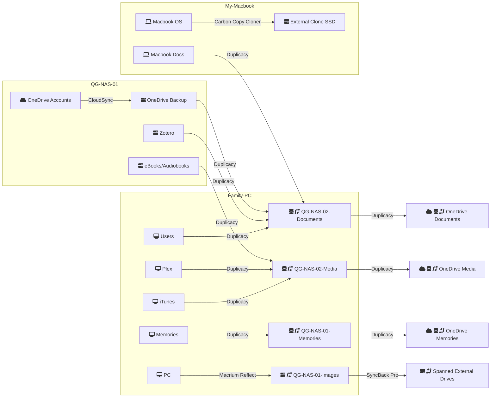
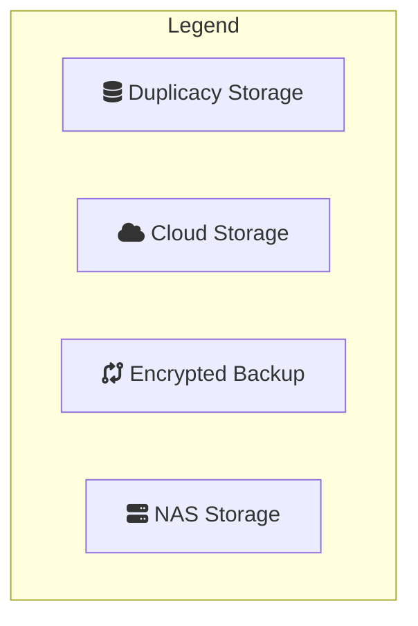

---
cssclasses:
  - max
tags:
  - backup-strategy
landscapes:
  - "[[The Garden Shed]]"
  - "[[Quantum OS]]"
date: 2023-12-03
JD-ID: "[[12.01 Backups]]"
---
I value backups of my data and systems. Having them means a level of security if something is lost, damaged, hacked, breaks. I may be over-compensating in some areas with multiple on-site and off-site backups. Where I do that, I'm also considering the other aspect of backups which is speed of restoration.
## 3-2-1 Backup!
I follow a 3-2-1 backup strategy.
- 3 copies
- using at least 2 physical media
- and 1 offsite.

For example, my family’s photos are stored on an SSD within the main home PC. 1 copy, 1 physical media, not offsite. I use [[Duplicacy]] to backup to a NAS daily. Now I have 2 copies, 2 physical media and none offsite. I then use [[Duplicacy]] again to copy them to [[OneDrive]] cloud storage. 3 copies, 2 physical media, 1 offsite. I’ve hit the 3-2-1 rule.
## What do I back up?
- C:\ operating systems or equivalent for all computers in the house
- Personal photos/home video library
- Documents/files

## Where do I back up to?
My backup targets are:
- [[Synology DiskStation DS920+]] This is the primary backup store. It consists of 4 x 4TB drives, with single-redundancy. I can lose any drive and still operate/recover. Only some of the space is backup. The rest is mostly media files.
- [[Synology DS115 NAS]] - 1 unit each of 4TB and 3TB. These are the backup targets for systems held on the [[Synology DiskStation DS920+|DS920+]] e.g., [[OneDrive]] backups, Docker etc.
- [OneDrive](https://www.microsoft.com/en-au/microsoft-365/onedrive/online-cloud-storage) - comes with Microsoft Office subscription. Backups of the NAS are sent to the spare space on our family OneDrive accounts. With 1TB each, there is more than enough.
- Any number of external USB drives 
	- 3 x 4TB USB3 portable drives as a single Bitlocker encrypted Windows spanned drive
	- 1 x 1TB USB3 portable drive - System images to Bitlocker encryption

## What do I backup with?
My backup software is
- [[Macrium Reflect Home Edition]] - primarily for imaging whole disks and quick restore in case of disk failure
- [[Duplicacy]] is the main backup tool. It works very well and runs on all operating systems. I've purchased the web interface as it's easier to manage.
- Synology HyperBackup - file backup for 1-2 backups from the NAS
- [SyncBack Pro](https://www.2brightsparks.com/syncback/sbpro.html) - copying files in bulk and transfer to Wasabi cloud storage and usb drives
- OneDrive's built-in sync

## For God’s sake, test

There is some complexity here. And I tested as I built it. I’ll also periodically monitor backups are occurring and test a restore. No matter what you personally decide to do, test you are backing up what you think and know how to recover it

I hope this has helped you understand backups a little more than before. There are lots of resources out there, usually provided by the backup software providers themselves.

## Addendum - OneDrive, iCloud etc.

Microsoft and Apple spruke the backup benefits of their cloud solutions. They are better than nothing, but are not the same as a backup solution like I’ve described here.

Firstly, they have limited retention periods. Let’s say you accidentally delete a file from OneDrive and remember 100 days later that you need it. Too bad. It’s gone. Microsoft and iCloud retention periods are not as long as you think. Refer their docs for more information.

Secondly, there is versioning for OneDrive at least. That’s good, but still limited in time.

I'm happy to use OneDrive as my offsite backup. It's highly unlikely I'll ever need it and it works fine for what I need,

> [!TIP] If you have an iPhone, ensure you’re syncing photos to the cloud. Pay the AUD \$1.50/\$4.99 for an extra 50GB/200GB to make sure you have enough space. Check your Settings for the status of your backups.

## Restore media
Restore media on USB lets me do a bare metal restore if I ever need to.
- [[Macrium Reflect Home Edition]] - last build [[2024-03-15]]