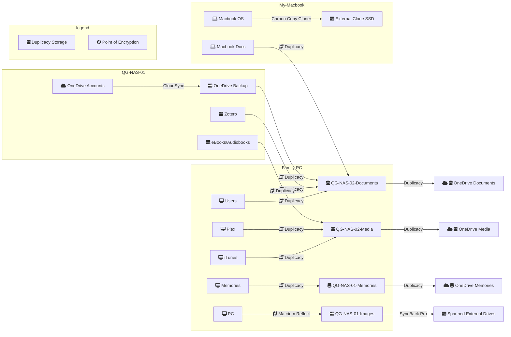

---
tags:
  - backup-strategy
landscapes:
  - "[[the-garden-shed]]"
  - "[[quantum-os]]"
date: 2023-12-03
growth: "[[Evergreen]]"
JD-ID: "[[12.01 Backups]]"
---

I value backups of my data and systems. Having them means a level of security if something is lost, damaged, hacked, breaks. I may be over-compensating in some areas with multiple on-site and off-site backups. Where I do that, I'm also considering the other aspect of backups which is speed of restoration.
 
## What do I back up?
- C:\ operating systems or equivalent for all computers in the house
- Personal photos/home video library
- Documents/files

## Where do I back up to?
My backup targets are:
- [[Synology DiskStation DS920+]]- 4 x 4TB drives, with single-redundancy. I can lose any drive and still operate/recover. 
- [[Synology DS115 NAS]] - 1 unit each of 4TB and 3TB.
- [Wasabi cloud storage](https://wasabi.com/) - (Amazon S3 compatible)
- [OneDrive](https://www.microsoft.com/en-au/microsoft-365/onedrive/online-cloud-storage) - comes with Microsoft Office subscription
- Any number of external USB drives 
	- 3 x 4TB drives as a single Bitlocker encrypted Windows spanned drive
	- Backup NAS-A - 1.88TB free

## What do I backup with?
My backup software is
- [[Macrium Reflect Home Edition]] - primarily for imaging whole disks and quick restore in case of disk failure
- Synology HyperBackup - file backup
- [SyncBack Pro](https://www.2brightsparks.com/syncback/sbpro.html) - copying files in bulk and transfer to Wasabi cloud storage and usb drives
- OneDrive's built-in sync

## What is backed up?
- [[Map of backup storage.xlsx]]
- [[3-2-1 Backup!]]

## Restore media
- [[Macrium Reflect Home Edition]] - last build [[2024-03-15]]