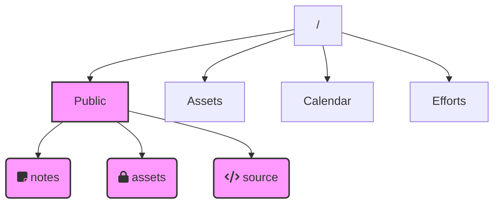

This site is built using [[Quartz 4]], and is organised using a folder structure to keep content, blog post and navigational items separate.

- `notes` is the folder where most of the garden's content is kept.
- `assets` holds supporting images and attachments, logically grouped by type and is not publicly accessible.
- `src` holds supporting source code for features such as image sliders.

The `Public` folder exists at the root level of my [[Obsidian]] vault. The [[Quartz 4]] system accesses this via a symlink from `content` to `Public`, keeping the systems separate.
