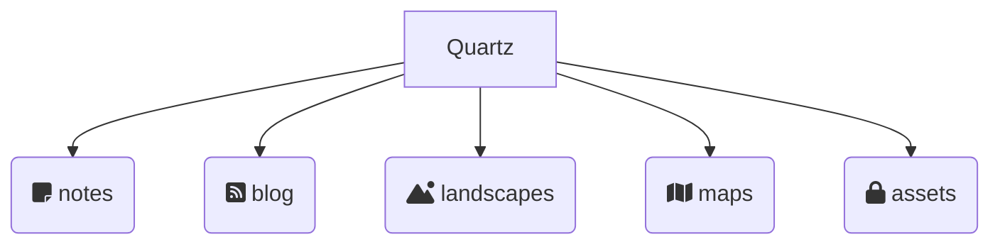

This site is built using [[Quartz 4]], and is organised using a folder structure to keep content, blog post and navigational items separate.

- **[notes](/notes/index)** is the folder where most of the garden's content is kept.
- **[blog](/blog/index)** holds transitional notes, relevant only to a point in time.
- [landscapes](/landscapes/index) is the index of all landscapes.
- [maps](/maps/index) is the index of all [[Map of content|maps of content]]
- **assets** holds supporting images and attachments, logically grouped by type and is not publicly accessible.

The `Quartz` folder exists at the root level of my [[Obisidan]] vault. The [[Quartz 4]] system accesses this via a symlink from `content` to `Quartz`, keeping the systems separate.
